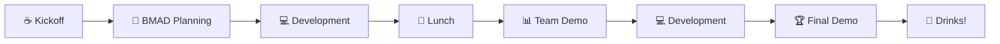

# Tips
## More than Yolo???

<v-clicks depth="2">

- Plan Mode
- Frameworks
  - BMAD
  - SpecKit
  - Superpowers

</v-clicks>

---
layout: default
---

# AI Bootcamp Flow

---
layout: socials
---

---
layout: default
---

# Powerpoint Source

  

    <QRCode url="https://github.com/itenium-be/Presentations" color="#343434" />
  

  <a href="https://github.com/itenium-be/Presentations" class="mt-4 text-lg">github.com/itenium-be/Presentations</a>

---
layout: end
---
