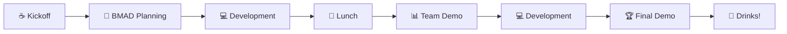

# Tips
## More than Yolo???

<v-clicks depth="2">

- Plan Mode
- Frameworks
  - BMAD
  - SpecKit
  - Superpowers

</v-clicks>

---
layout: default
routeAlias: mermaid
---

# AI Bootcamp Flow

```mermaid
graph LR
  A[☕ Kickoff] --> B[🧠 BMAD Planning]
  B --> C[💻 Development]
  C --> D[🍕 Lunch]
  D --> E[📊 Team Demo]
  E --> F[💻 Development]
  F --> G[🏆 Final Demo]
  G --> H[🍻 Drinks!]
```

---
layout: socials
routeAlias: socials
---

---
layout: source
routeAlias: source
source: itenium-be/Presentations
---

---
layout: end
routeAlias: end
---
